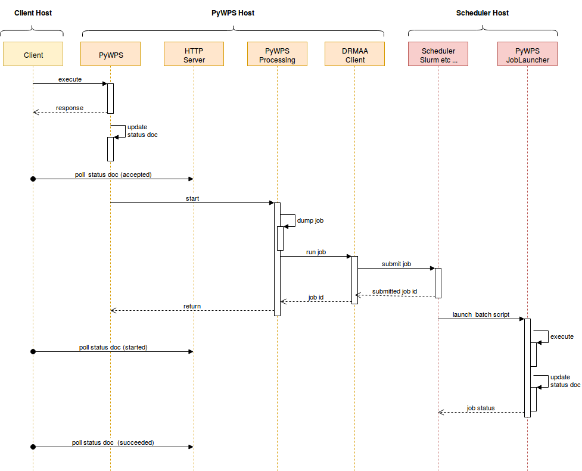
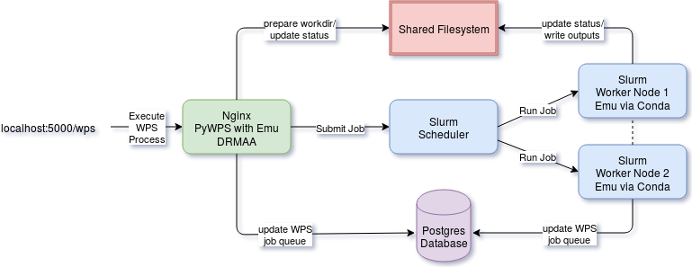

.. _extensions:

Extensions
==========

PyWPS has extensions to enhance its usability in special uses cases, for example
to run Web Processing Services at High Performance Compute (HPC) centers. These
extensions are disabled by default. They need a modified configuration and have
additional software packages. The extensions are:

* Using batch job schedulers (distributed resource management) at HPC compute
  centers.
* Using container solutions like `Docker <https://www.docker.com/>`_ in a cloud
  computing infrastructure.

Job Scheduler Extension
-----------------------

By default PyWPS executes all processes on the same machine as the PyWPS service
is running on. Using the PyWPS scheduler extension it becomes possible to
delegate the execution of asynchronous processes to a scheduler system like
`Slurm <https://slurm.schedmd.com/>`_,
`Grid Engine <https://en.wikipedia.org/wiki/Univa_Grid_Engine>`_ and
`TORQUE <https://en.wikipedia.org/wiki/TORQUE>`_. By enabling this extension one
can handle the processing workload using an existing scheduler system commonly
found at High Performance Compute (HPC) centers.

.. note:: The PyWPS process implementations are not changed by using the
  scheduler extension.

To activate this extension you need to edit the ``pywps.cfg`` configuration file
and make the following changes::

  [processing]
  mode = scheduler

The scheduler extension uses the `DRMAA`_
library to talk to the different scheduler systems. Install the additional
Python dependencies using pip::

  $ pip install -r requirements-processing.txt  # drmaa

If you are using the `conda <https://conda.io/docs/>`_ package manager you can
install the dependencies with::

  $ conda install drmaa dill

The package `dill`_ is an enhanced version
of the Python pickle module for serializing and de-serializing Python objects.

.. warning:: In addition you need to install and configure the drmaa modules for
  your scheduler system on the machine PyWPS is running on. Follow the
  instructions given in the `DRMAA`_ documentation and by your scheduler system
  installation guide.

.. note:: See an **example** on how to use this extension with a
  Slurm batch system in a
  `docker demo <https://github.com/bird-house/birdhouse-docker-images/tree/master/pywps-scheduler-demo>`_.

.. note:: `COWS WPS <http://cows.ceda.ac.uk/cows_wps/install.html#installing-the-sun-grid-engine-scheduler>`_
  has a scheduler extension for Sun Grid Engine (SGE).

---------------------------------------------
Interactions of PyWPS with a scheduler system
---------------------------------------------

The PyWPS scheduler extension uses the Python `dill`_ library to dump
and load the processing job to/from filesystem. The batch script executed
on the scheduler system calls the PyWPS ``joblauncher`` script with the dumped
job status and executes the job (no WPS service running on scheduler).
The job status is updated on the filesystem. Both the PyWPS service and
the ``joblauncher`` script use the same PyWPS configuration. The scheduler
assumes that the PyWPS server has a shared filesystem with the scheduler system
so that XML status documents and WPS outputs can be found at the same file
location. See the interaction diagram how the communication between PyWPS and
the scheduler works.

    Interaction diagram for PyWPS scheduler extension.

The following image shows an example of using the scheduler extension with
Slurm.

    Example of PyWPS scheduler extension usage with Slurm.

.. _DRMAA: https://pypi.python.org/pypi/drmaa
.. _dill: https://pypi.python.org/pypi/dill

Docker Container Extension
---------------------------

.. todo:: This extension is on our wish list. In can be used to encapsulate
  and control the execution of a process. It enhances also the use case of
  Web Processing Services in a cloud computing infrastructure.
