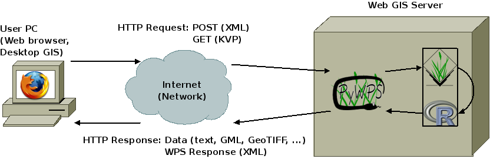

************
How it works
************
PyWPS is a translator-proxy application between client (Web Browser, Desktop
GIS, command line tool, ...) and working tool installed on the server.
PyWPS does not process the data by it self. As working tool, GRASS GIS, GDAL, PROJ, R
and other programs can be used.

